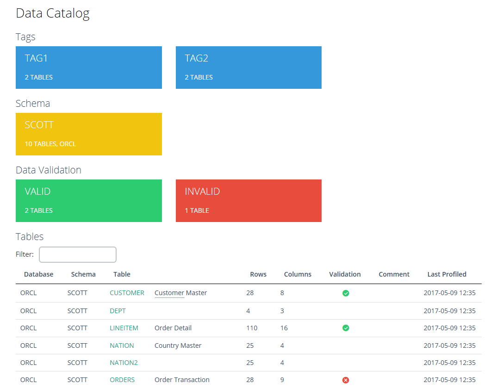
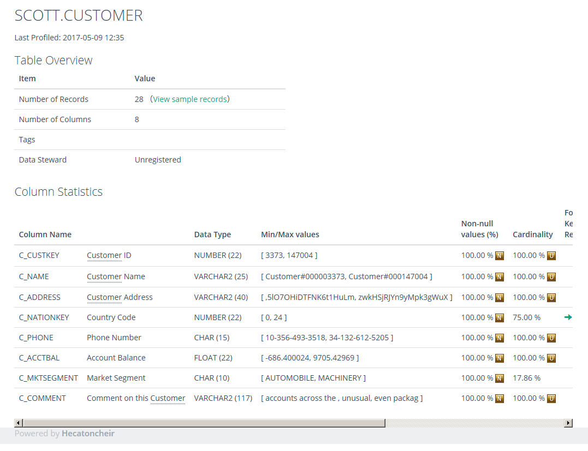
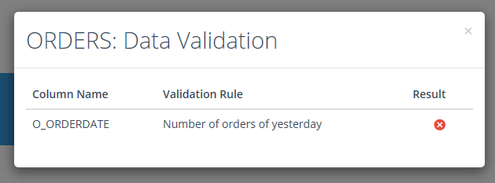
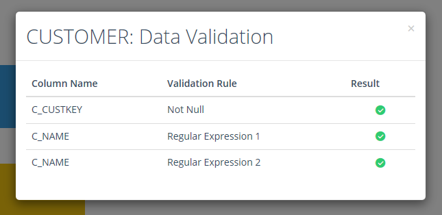
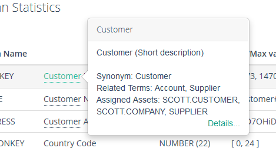

# Hecatoncheir: The Data Stewardship Studio


## About Hecatoncheir

Hecatoncheir is software that helps data stewards to ensure data
quality management and data governance with using database metadata,
statistics and data profiles.


## Key Features

Hecatoncheir allows you to:

* Collect metadata from database dictionaries/catalogs
* Profile database tables and columns
* Validate data with several business rules
* Catalog data sets by tagging and importing additional metadata
* Build a business glossary
* Curate everything which needs to be shared with data developers and users

## Screenshots

### Data Catalog Top Page



### Metadata and Statistics



### Data Validation





### Business Glossary




## Requirements

### Target databases

The latest version supports following databases:

* Oracle Database / Oracle Exadata
* SQL Server
* PostgreSQL
* MySQL
* Amazon Redshift
* Google BigQuery

Following databases are coming in the future releases:

* DB2
* DB2 PureScale (Neteeza)
* Apache Hive
* Apache Spark
* Vertica

### Operating Systems

Hecatoncheir can work on following operating systems.

* Red Hat Enterprise Linux 6 (x86_64)
* Red Hat Enterprise Linux 7 (x86_64)
* Windows 7 (64bit / 32bit)

### Python

Hecatoncheir requires python 2.7.

Also you need to have one or more database drivers for the databases
you want to connect to:

* cx-Oracle: Oracle Database / Oracle Exadata
* MySQL-python: MySQL
* psycopg2: PostgreSQL, Amazon Redshift
* pymssql: SQL Server


## Installation

To install Hecatoncheir, clone the git repository and install it with the pip command as following.

```
git clone https://github.com/snaga/Hecatoncheir.git
cd Hecatoncheir
pip install -r requirements.txt
pip install .
```

## Quick Start

* [Quick Start [EN]](http://hecatoncheir.readthedocs.io/en/latest/quick-start.html)
* [Quick Start [JA]](http://hecatoncheir-ja.readthedocs.io/ja/latest/quick-start.html)

## Documentation

* [Hecatoncheir: The Data Stewardship Studio [EN]](http://hecatoncheir.readthedocs.io/)
* [Hecatoncheir: The Data Stewardship Studio [JA]](http://hecatoncheir-ja.readthedocs.io/)


## License

Apache License Version 2.0.

See the [LICENSE](LICENSE) file for more information.
